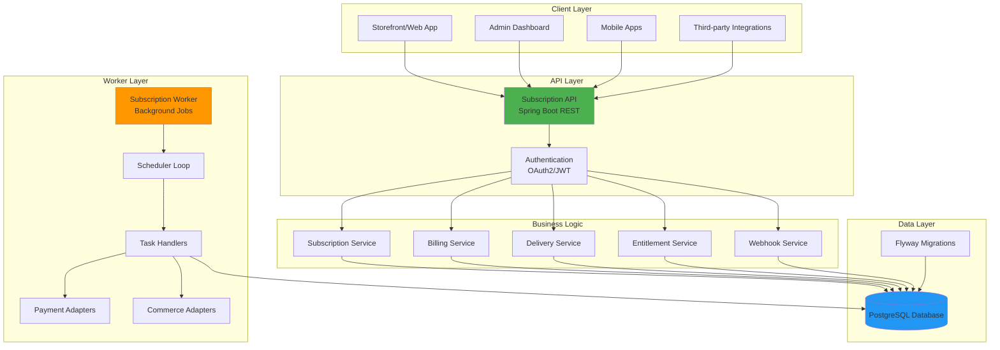
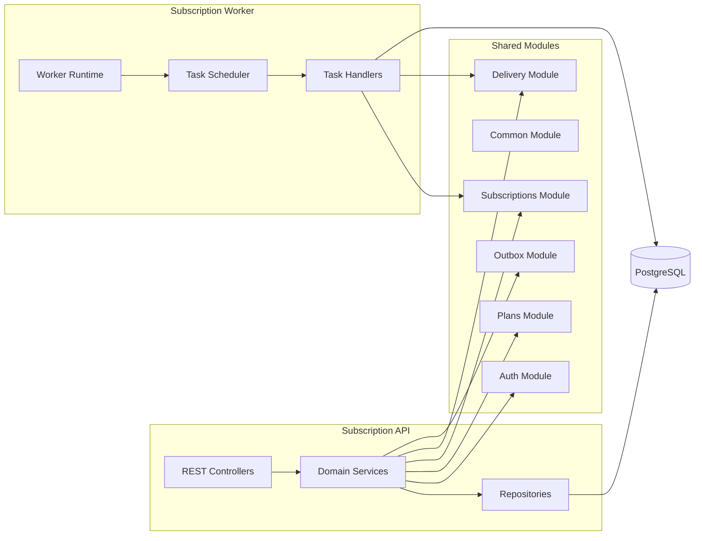
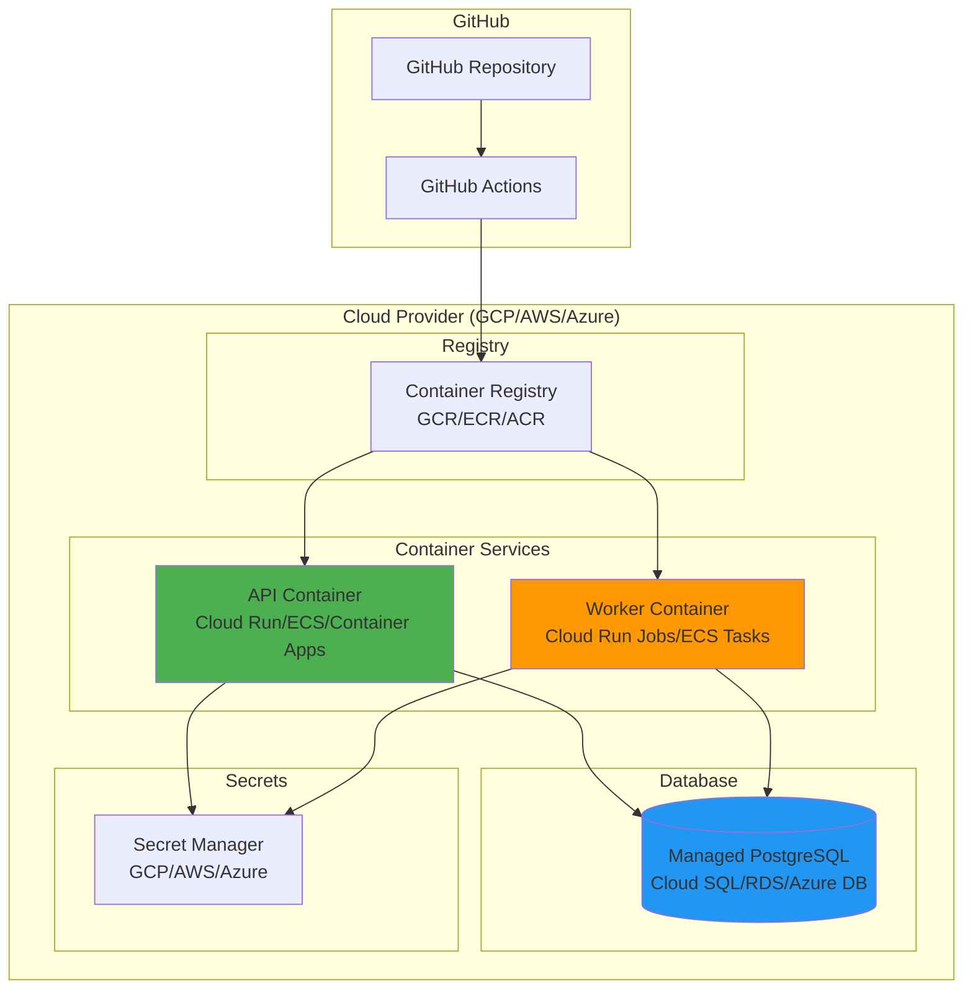
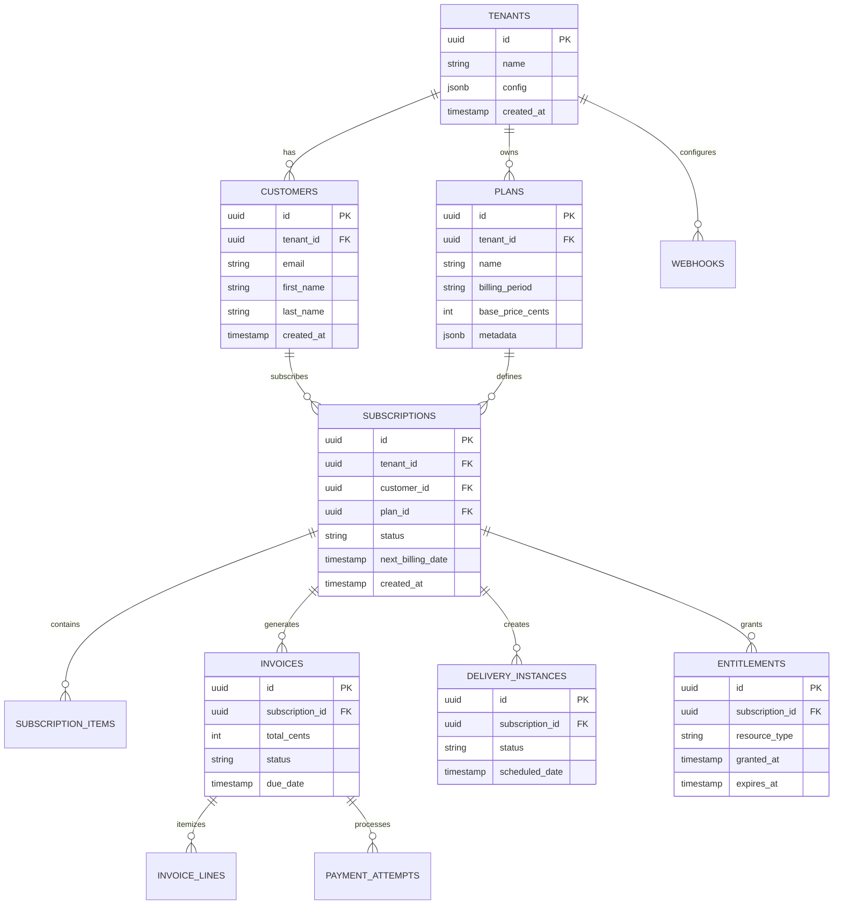
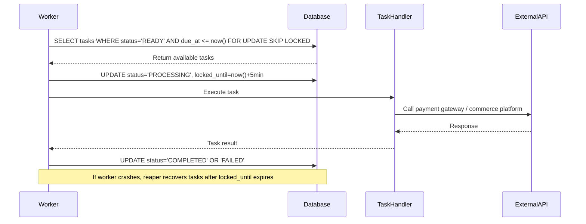
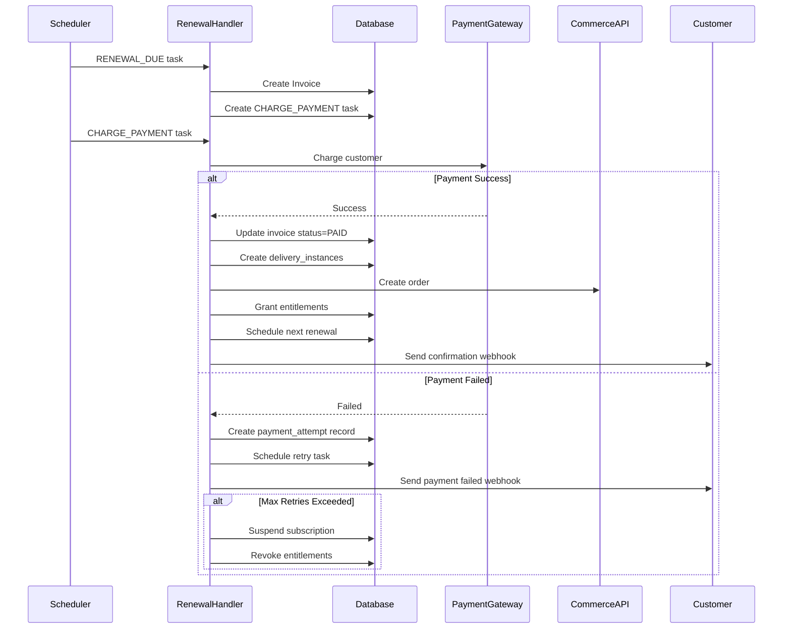

# 🚀 SubscriptionManager - Headless Subscription Engine

<div align="center">


**API-first, multi-tenant subscription management platform for ecommerce and digital services**

[Features](#-key-features) • [Architecture](#-architecture) • [API Documentation](#-api-documentation) • [Deployment](#-deployment) • [Getting Started](#-quick-start)

</div>

---

## 👨‍💻 Author

**Neeraj Yadav**

[](https://github.com/neeraj-agentic-lab)
[](https://www.linkedin.com/in/n-yadav/)

---

## 📖 Table of Contents

- [Overview](#-overview)
- [Key Features](#-key-features)
- [Architecture](#-architecture)
- [Technology Stack](#-technology-stack)
- [Domain Model](#-domain-model)
- [API Documentation](#-api-documentation)
- [Deployment](#-deployment)
- [Quick Start](#-quick-start)
- [Testing](#-testing)
- [Contributing](#-contributing)

---

## 🌟 Overview

The **Headless Subscription Engine** is a high-scale, API-first subscription management platform designed for modern ecommerce and digital services. Built with **correctness, idempotency, and auditability** as core principles, it handles millions of subscriptions with zero double billing and zero duplicate orders.

### What Makes This Different?

- **Postgres-Only V1 Architecture**: No Kafka, no Redis, no external queues - just Postgres as the single source of truth
- **Multi-Tenant SaaS**: Strong tenant isolation with row-level security
- **Subscription Types**: Physical products, digital services, and hybrid subscriptions
- **Financial-Grade Correctness**: Designed like banking systems, not cron jobs
- **Cloud-Native**: Deploy to GCP, AWS, or Azure with a single configuration file

---

## ✨ Key Features

### Core Capabilities

- ✅ **API-First Design** - RESTful APIs with comprehensive OpenAPI/Swagger documentation
- ✅ **Multi-Tenant SaaS** - Complete tenant isolation with OAuth2/JWT authentication
- ✅ **Flexible Subscription Models** - Support for physical, digital, and hybrid subscriptions
- ✅ **High Scale** - Handle 50k-100k renewals per hour with horizontal scaling
- ✅ **Zero Double Billing** - Database constraints and idempotency keys prevent duplicates
- ✅ **Transactional Outbox** - Reliable event publishing with guaranteed delivery
- ✅ **Delivery Management** - Track and manage physical/digital deliveries per cycle
- ✅ **Entitlement System** - Grant and revoke digital access rights automatically
- ✅ **Payment Retry Logic** - Configurable retry strategies with exponential backoff
- ✅ **Webhook Integration** - Real-time notifications for subscription events

### V1 Architecture Guardrails

**V1 intentionally avoids infrastructure sprawl.**

| Component | V1 Status |
|-----------|-----------|
| Kafka / Pulsar | ❌ Not used |
| Redis | ❌ Not used |
| External queues | ❌ Not used |
| Cron per subscription | ❌ Not used |
| Postgres | ✅ **Single source of truth** |

**All scheduling, retries, idempotency, and ordering are implemented using Postgres.**

## 🧠 Core Concepts

### Subscription = Contract  
Stored once, mutable for future cycles. Represents the ongoing relationship between customer and service.

### Invoice / Delivery / Entitlement = Snapshot  
Created per billing cycle, **immutable**, audit-safe. Provides complete historical record.

### Scheduling = Data, Not Cron  
All async work is driven by a DB table (`scheduled_tasks`). No external schedulers needed.

---

## 🏗 Architecture

### System Architecture Diagram



### Component Architecture



### Deployment Architecture



---

## 📦 Technology Stack

### Backend

| Technology | Version | Purpose |
|------------|---------|---------|
| **Java** | 17 | Primary language |
| **Spring Boot** | 3.2.1 | Application framework |
| **Spring Security** | 6.x | OAuth2/JWT authentication |
| **jOOQ** | 3.18+ | Type-safe SQL queries |
| **Flyway** | 9.22.3 | Database migrations |
| **PostgreSQL** | 15 | Primary database |

### API & Documentation

| Technology | Purpose |
|------------|---------|
| **SpringDoc OpenAPI** | API documentation |
| **Swagger UI** | Interactive API explorer |
| **REST** | API architecture style |

### DevOps & Deployment

| Technology | Purpose |
|------------|---------|
| **Docker** | Containerization |
| **GitHub Actions** | CI/CD pipeline |
| **Gradle** | Build automation |
| **Testcontainers** | Integration testing |

### Cloud Platforms (Multi-Cloud Support)

| Platform | Services Used |
|----------|---------------|
| **Google Cloud Platform** | Cloud Run, Cloud SQL, Secret Manager, Artifact Registry |
| **Amazon Web Services** | ECS Fargate, RDS, Secrets Manager, ECR |
| **Microsoft Azure** | Container Apps, Azure Database for PostgreSQL, Key Vault, ACR |

### Testing

| Technology | Purpose |
|------------|---------|
| **JUnit 5** | Unit testing framework |
| **Testcontainers** | Integration testing with real Postgres |
| **REST Assured** | API testing |
| **Mockito** | Mocking framework |

---

## 📚 Domain Model

### Database Schema Overview



### Core Tables

| Table | Purpose | Key Fields |
|-------|---------|------------|
| `tenants` | SaaS tenants (merchants) | id, name, config |
| `customers` | End customers | id, tenant_id, email |
| `plans` | Subscription products | id, name, billing_period, base_price_cents |
| `subscriptions` | Subscription contracts | id, customer_id, plan_id, status, next_billing_date |
| `subscription_items` | Items/components per subscription | id, subscription_id, plan_id, quantity |
| `invoices` | Billing snapshots | id, subscription_id, total_cents, status |
| `invoice_lines` | Invoice breakdown | id, invoice_id, description, amount_cents |
| `payment_attempts` | Payment retries | id, invoice_id, status, attempt_number |
| `delivery_instances` | One delivery/order per cycle | id, subscription_id, status, scheduled_date |
| `entitlements` | Digital access rights | id, subscription_id, resource_type, expires_at |

### Platform Tables

| Table | Purpose | Key Fields |
|-------|---------|------------|
| `scheduled_tasks` | DB-driven scheduler queue | id, task_type, status, due_at, locked_until |
| `outbox_events` | Transactional outbox | id, event_type, payload, published_at |
| `idempotency_keys` | API idempotency | key, tenant_id, response, created_at |
| `webhooks` | Webhook configurations | id, tenant_id, url, events |
| `job_execution_history` | Worker job tracking | id, job_name, status, started_at, completed_at |

---

## 🔄 How Scheduling Works

### Database-Driven Scheduler

All async work is managed through the `scheduled_tasks` table - no external schedulers needed.



### Scheduler SQL Query

```sql
SELECT *
FROM scheduled_tasks
WHERE status = 'READY'
  AND due_at <= now()
  AND (locked_until IS NULL OR locked_until < now())
FOR UPDATE SKIP LOCKED
LIMIT 100;
```

**Key Features:**
- `FOR UPDATE SKIP LOCKED` prevents race conditions
- `locked_until` enables automatic recovery from crashes
- No external message broker required
- Fully distributed and horizontally scalable

---

## 🔁 Subscription Renewal Flow

### Renewal Process Diagram



### Detailed Steps

1. **RENEWAL_DUE Task Fires**
   - Triggered based on `next_billing_date`
   - Creates invoice snapshot

2. **Invoice Creation**
   - Calculate total from subscription items
   - Apply discounts/coupons
   - Store immutable invoice record

3. **CHARGE_PAYMENT Task**
   - Attempt payment via configured gateway
   - Record payment attempt

4. **On Payment Success:**
   - Mark invoice as PAID
   - Create `delivery_instances` for physical products
   - Create order in commerce platform
   - Grant/extend digital entitlements
   - Schedule next renewal
   - Publish webhook events

5. **On Payment Failure:**
   - Record failed attempt
   - Schedule retry with exponential backoff
   - After max retries: suspend subscription
   - Optionally revoke entitlements

## 📡 API Documentation

### API Overview

All APIs are RESTful, use JSON for request/response bodies, and require OAuth2/JWT authentication.

**Base URL:** `https://your-domain.com/api`

**Swagger UI:** `https://your-domain.com/api/swagger-ui.html`

**OpenAPI Spec:** `https://your-domain.com/api/v3/api-docs`

### Authentication

All endpoints require a valid JWT token in the `Authorization` header:

```http
Authorization: Bearer <your-jwt-token>
```

The JWT must contain a tenant claim (`tenant_id`, `org_id`, or `organization`) for multi-tenant isolation.

---

### 📋 Subscription Management APIs

#### Create Subscription

```http
POST /v1/subscriptions
Content-Type: application/json
Idempotency-Key: unique-key-123
Authorization: Bearer <token>

{
  "planId": "550e8400-e29b-41d4-a716-446655440000",
  "customerId": "customer-uuid",
  "startDate": "2024-01-01",
  "billingPeriod": "MONTHLY",
  "items": [
    {
      "planId": "plan-uuid",
      "quantity": 1,
      "priceCents": 2999
    }
  ]
}
```

**Response (201 Created):**
```json
{
  "subscriptionId": "sub-uuid",
  "status": "ACTIVE",
  "nextBillingDate": "2024-02-01",
  "createdAt": "2024-01-01T00:00:00Z"
}
```

#### Get Subscription

```http
GET /v1/subscriptions/{subscriptionId}
Authorization: Bearer <token>
```

**Response (200 OK):**
```json
{
  "id": "sub-uuid",
  "customerId": "customer-uuid",
  "planId": "plan-uuid",
  "status": "ACTIVE",
  "currentPeriodStart": "2024-01-01",
  "currentPeriodEnd": "2024-02-01",
  "nextBillingDate": "2024-02-01",
  "items": [...],
  "createdAt": "2024-01-01T00:00:00Z"
}
```

#### Update Subscription

```http
PATCH /v1/subscriptions/{subscriptionId}
Content-Type: application/json
Idempotency-Key: update-key-456
Authorization: Bearer <token>

{
  "items": [
    {
      "planId": "new-plan-uuid",
      "quantity": 2
    }
  ]
}
```

#### Pause Subscription

```http
POST /v1/subscription-mgmt/{subscriptionId}
Content-Type: application/json
Idempotency-Key: pause-key-789
Authorization: Bearer <token>

{
  "operation": "PAUSE",
  "customerId": "customer-uuid"
}
```

#### Resume Subscription

```http
POST /v1/subscription-mgmt/{subscriptionId}
Content-Type: application/json
Authorization: Bearer <token>

{
  "operation": "RESUME",
  "customerId": "customer-uuid"
}
```

#### Cancel Subscription

```http
POST /v1/subscription-mgmt/{subscriptionId}
Content-Type: application/json
Authorization: Bearer <token>

{
  "operation": "CANCEL",
  "customerId": "customer-uuid",
  "reason": "Customer request"
}
```

---

### 👥 Customer APIs

#### Create Customer

```http
POST /v1/customers
Content-Type: application/json
Idempotency-Key: customer-key-123
Authorization: Bearer <token>

{
  "email": "customer@example.com",
  "firstName": "John",
  "lastName": "Doe",
  "paymentMethodRef": "pm_stripe_123"
}
```

#### Get Customer Subscriptions

```http
GET /v1/customer-subscriptions?customerEmail=customer@example.com
Authorization: Bearer <token>
```

#### Get Customer Dashboard

```http
GET /v1/customer-subscriptions/{subscriptionId}/dashboard?customerEmail=customer@example.com
Authorization: Bearer <token>
```

**Response:**
```json
{
  "subscription": {...},
  "upcomingInvoice": {...},
  "nextDelivery": {...},
  "entitlements": [...]
}
```

---

### 📦 Plan Management APIs

#### Create Plan

```http
POST /v1/plans
Content-Type: application/json
Idempotency-Key: plan-key-123
Authorization: Bearer <token>

{
  "name": "Premium Monthly",
  "description": "Premium subscription plan",
  "billingPeriod": "MONTHLY",
  "basePriceCents": 2999,
  "trialDays": 14,
  "metadata": {
    "features": ["feature1", "feature2"]
  }
}
```

#### List Plans

```http
GET /v1/plans
Authorization: Bearer <token>
```

#### Get Plan

```http
GET /v1/plans/{planId}
Authorization: Bearer <token>
```

#### Update Plan

```http
PUT /v1/plans/{planId}
Content-Type: application/json
Authorization: Bearer <token>

{
  "name": "Premium Monthly Updated",
  "basePriceCents": 3499
}
```

---

### 🛒 Ecommerce Subscription APIs

#### Create Ecommerce Subscription

```http
POST /v1/ecommerce/subscriptions
Content-Type: application/json
Idempotency-Key: ecom-key-123
Authorization: Bearer <token>

{
  "basePlanId": "plan-uuid",
  "products": [
    {
      "planId": "product-plan-uuid",
      "productName": "Coffee Beans",
      "quantity": 2,
      "priceCents": 1999
    }
  ],
  "customerEmail": "customer@example.com",
  "customerFirstName": "Jane",
  "customerLastName": "Smith",
  "paymentMethodRef": "pm_stripe_456"
}
```

---

### 🚚 Delivery APIs

#### Get Upcoming Deliveries

```http
GET /v1/deliveries/upcoming?subscriptionId={id}&count=3
Authorization: Bearer <token>
```

**Response:**
```json
{
  "deliveries": [
    {
      "id": "delivery-uuid",
      "subscriptionId": "sub-uuid",
      "scheduledDate": "2024-02-01",
      "status": "SCHEDULED",
      "items": [...]
    }
  ]
}
```

#### Get Delivery Details

```http
GET /v1/deliveries/{deliveryId}
Authorization: Bearer <token>
```

---

### 🔔 Webhook APIs

#### Register Webhook

```http
POST /v1/webhooks
Content-Type: application/json
Idempotency-Key: webhook-key-123
Authorization: Bearer <token>

{
  "url": "https://your-app.com/webhooks",
  "events": [
    "subscription.created",
    "subscription.renewed",
    "payment.failed"
  ]
}
```

#### List Webhooks

```http
GET /v1/webhooks
Authorization: Bearer <token>
```

#### Update Webhook Status

```http
PATCH /v1/webhooks/{webhookId}/status
Content-Type: application/json
Authorization: Bearer <token>

{
  "active": false
}
```

---

### 🏢 Tenant Management APIs

#### Create Tenant

```http
POST /v1/tenants
Content-Type: application/json
Authorization: Bearer <admin-token>

{
  "name": "Acme Corp",
  "config": {
    "timezone": "America/New_York",
    "currency": "USD"
  }
}
```

#### List Tenants

```http
GET /v1/tenants
Authorization: Bearer <admin-token>
```

---

### 📊 Webhook Events

The system publishes the following webhook events:

| Event | Description | Payload |
|-------|-------------|---------|
| `subscription.created` | New subscription created | Subscription object |
| `subscription.updated` | Subscription modified | Subscription object |
| `subscription.renewed` | Successful renewal | Invoice + Subscription |
| `subscription.paused` | Subscription paused | Subscription object |
| `subscription.resumed` | Subscription resumed | Subscription object |
| `subscription.cancelled` | Subscription cancelled | Subscription object |
| `payment.succeeded` | Payment successful | Payment attempt object |
| `payment.failed` | Payment failed | Payment attempt object |
| `delivery.scheduled` | Delivery scheduled | Delivery instance object |
| `delivery.shipped` | Delivery shipped | Delivery instance object |
| `entitlement.granted` | Access granted | Entitlement object |
| `entitlement.revoked` | Access revoked | Entitlement object |

---

## 🔐 Security & Idempotency

### Idempotency Keys

All write operations (POST, PUT, PATCH) require an `Idempotency-Key` header to prevent duplicate operations:

```http
Idempotency-Key: unique-operation-id-123
```

**Benefits:**
- Prevents double billing
- Prevents duplicate subscriptions
- Safe to retry failed requests
- 24-hour idempotency window

### Database Constraints

Multiple layers of protection prevent data corruption:

```sql
-- Prevent duplicate invoices per billing period
UNIQUE (subscription_id, billing_period_start)

-- Prevent duplicate deliveries
UNIQUE (subscription_id, scheduled_date)

-- Prevent duplicate payment attempts
UNIQUE (invoice_id, idempotency_key)
```

### Multi-Tenant Isolation

- Row-level security enforced at database level
- JWT claims validated on every request
- Tenant ID automatically injected into all queries
- Cross-tenant access blocked by design

## 🚀 Deployment

### Multi-Cloud Support

Deploy to **Google Cloud Platform**, **Amazon Web Services**, or **Microsoft Azure** with a single configuration file.

```yaml
# deployment-config.yaml
target_cloud: gcp  # Options: gcp | aws | azure

app:
  name: subscription-manager
  environment: production

database:
  tier: small  # small | medium | large
  storage_gb: 10

api:
  compute:
    size: small
    min_instances: 1
    max_instances: 10
```

### Deployment Options

#### Option 1: Automatic (GitHub Actions)

1. Edit `deployment-config.yaml`
2. Push to GitHub
3. Automatic deployment via GitHub Actions

#### Option 2: Manual (GitHub UI)

1. Go to **Actions** → **Manual Deploy (UI)**
2. Select cloud, environment, and options
3. Click **Run workflow**

#### Option 3: Local Deployment

```bash
./infrastructure/deploy.sh
```

### Cloud Services Used

| Service | GCP | AWS | Azure |
|---------|-----|-----|-------|
| **API** | Cloud Run | ECS Fargate | Container Apps |
| **Worker** | Cloud Run Jobs | ECS Scheduled Tasks | Container Apps Jobs |
| **Database** | Cloud SQL | RDS PostgreSQL | Azure Database for PostgreSQL |
| **Secrets** | Secret Manager | Secrets Manager | Key Vault |
| **Registry** | Artifact Registry | ECR | Container Registry |

### Prerequisites

- Docker installed
- Cloud CLI configured (gcloud/aws/az)
- GitHub repository with secrets configured

For detailed deployment instructions, see [`README-DEPLOYMENT.md`](README-DEPLOYMENT.md).

---

## 🚀 Quick Start

### Local Development Setup

#### 1. Prerequisites

- Java 17+
- Docker & Docker Compose
- PostgreSQL 15 (or use Docker)

#### 2. Clone Repository

```bash
git clone https://github.com/neeraj-agentic-lab/subscription-manager.git
cd subscription-manager
```

#### 3. Start PostgreSQL

```bash
docker-compose up -d
```

#### 4. Run Database Migrations

```bash
./gradlew flywayMigrate
```

#### 5. Start API Server

```bash
./gradlew :apps:subscription-api:bootRun
```

The API will be available at `http://localhost:8080/api`

#### 6. Access Swagger UI

Open your browser to:
```
http://localhost:8080/api/swagger-ui.html
```

#### 7. Start Worker (Optional)

```bash
./gradlew :apps:subscription-worker:bootRun
```

### Project Structure

```
SubscriptionManager/
├── apps/
│   ├── subscription-api/          # REST API application
│   │   ├── src/main/java/         # API controllers & services
│   │   ├── src/main/resources/    # Configuration files
│   │   └── Dockerfile              # API container image
│   └── subscription-worker/        # Background worker application
│       ├── src/main/java/         # Worker jobs & schedulers
│       └── Dockerfile              # Worker container image
├── modules/
│   ├── auth/                       # Authentication & authorization
│   ├── common/                     # Shared utilities
│   ├── domain-plans/               # Plan management domain
│   ├── domain-subscriptions/       # Subscription domain
│   ├── delivery/                   # Delivery management
│   └── outbox/                     # Transactional outbox pattern
├── db/
│   └── migrations/                 # Flyway database migrations
├── infrastructure/
│   ├── common/                     # Shared deployment scripts
│   ├── gcp/                        # GCP deployment scripts
│   ├── aws/                        # AWS deployment scripts
│   └── azure/                      # Azure deployment scripts
├── .github/
│   └── workflows/                  # GitHub Actions CI/CD
├── deployment-config.yaml          # Multi-cloud deployment config
└── README-DEPLOYMENT.md            # Deployment documentation
```

---

## 🧪 Testing

### Running Tests

```bash
# Run all tests
./gradlew test

# Run specific test class
./gradlew test --tests SecurityAndErrorHandlingTest

# Run integration tests only
./gradlew integrationTest
```

### Test Coverage

The project includes comprehensive tests:

- **Unit Tests**: Domain logic and business rules
- **Integration Tests**: API endpoints with real database (Testcontainers)
- **Scenario Tests**: End-to-end subscription workflows
- **Security Tests**: Authentication, authorization, and tenant isolation

### Key Test Scenarios

1. **Renewal Idempotency**: Ensures no double billing
2. **Payment Retry Logic**: Validates exponential backoff
3. **Delivery Uniqueness**: Prevents duplicate orders
4. **Tenant Isolation**: Verifies cross-tenant access prevention
5. **Webhook Delivery**: Tests event publishing and retries

### Test Configuration

Tests use Testcontainers to spin up a real PostgreSQL database:

```java
@Testcontainers
@SpringBootTest
class SubscriptionApiTest {
    @Container
    static PostgreSQLContainer<?> postgres = 
        new PostgreSQLContainer<>("postgres:15");
}
```

---

## � Performance & Scale

### V1 Scale Expectations

- **Throughput**: 50k-100k renewals/hour with proper batching
- **Latency**: <100ms API response time (p95)
- **Concurrency**: Horizontally scalable workers
- **Database**: Postgres partitioning available when needed

### Optimization Strategies

1. **Connection Pooling**: HikariCP with optimized settings
2. **Batch Processing**: Process renewals in batches of 100-1000
3. **Indexing**: Strategic indexes on frequently queried columns
4. **Worker Scaling**: Add more worker instances for higher throughput
5. **Database Partitioning**: Partition by tenant_id or date when needed

### Monitoring

- **Health Checks**: `/actuator/health`
- **Metrics**: `/actuator/metrics`
- **Logging**: Structured JSON logs with correlation IDs
- **Tracing**: OpenTelemetry integration ready

---

## 🛣 Evolution Path (Future)

V1 is intentionally simple, but **future-ready**:

| Phase | Upgrade | Benefit |
|-------|---------|---------|
| **Phase 2** | Kafka for command/event streaming | Event sourcing, audit trail |
| **Phase 3** | Redis for rate limiting & caching | Improved performance |
| **Phase 4** | Service decomposition | Independent scaling |
| **Phase 5** | Multi-region active-active | Global availability |

**No domain rewrite required** - the current architecture supports all future enhancements.

---

## 🤝 Contributing

This is a platform-grade system. Contributions should prioritize **correctness, idempotency, and auditability** over cleverness.

### Contribution Guidelines

1. **Fork** the repository
2. **Create** a feature branch (`git checkout -b feature/amazing-feature`)
3. **Write** tests for your changes
4. **Ensure** all tests pass (`./gradlew test`)
5. **Commit** your changes (`git commit -m 'Add amazing feature'`)
6. **Push** to the branch (`git push origin feature/amazing-feature`)
7. **Open** a Pull Request

### Code Standards

- Follow existing code style and patterns
- Write comprehensive tests (unit + integration)
- Document public APIs with OpenAPI annotations
- Ensure idempotency for all write operations
- Maintain database constraints for data integrity

---

## 📄 License

MIT License

Copyright (c) 2024 Neeraj Yadav

Permission is hereby granted, free of charge, to any person obtaining a copy
of this software and associated documentation files (the "Software"), to deal
in the Software without restriction, including without limitation the rights
to use, copy, modify, merge, publish, distribute, sublicense, and/or sell
copies of the Software, and to permit persons to whom the Software is
furnished to do so, subject to the following conditions:

The above copyright notice and this permission notice shall be included in all
copies or substantial portions of the Software.

THE SOFTWARE IS PROVIDED "AS IS", WITHOUT WARRANTY OF ANY KIND, EXPRESS OR
IMPLIED, INCLUDING BUT NOT LIMITED TO THE WARRANTIES OF MERCHANTABILITY,
FITNESS FOR A PARTICULAR PURPOSE AND NONINFRINGEMENT. IN NO EVENT SHALL THE
AUTHORS OR COPYRIGHT HOLDERS BE LIABLE FOR ANY CLAIM, DAMAGES OR OTHER
LIABILITY, WHETHER IN AN ACTION OF CONTRACT, TORT OR OTHERWISE, ARISING FROM,
OUT OF OR IN CONNECTION WITH THE SOFTWARE OR THE USE OR OTHER DEALINGS IN THE
SOFTWARE.

---

## 📞 Contact & Support

**Neeraj Yadav**

- 🐙 GitHub: [@neeraj-agentic-lab](https://github.com/neeraj-agentic-lab)
- 💼 LinkedIn: [n-yadav](https://www.linkedin.com/in/n-yadav/)
- 📧 Email: Available on GitHub profile

---

## ⭐ Show Your Support

If you find this project useful, please consider:

- ⭐ **Starring** the repository
- 🐛 **Reporting** bugs and issues
- 💡 **Suggesting** new features
- 🤝 **Contributing** to the codebase

---

## 🙏 Acknowledgments

Built with modern technologies and best practices:

- Spring Boot ecosystem for robust application framework
- PostgreSQL for reliable data persistence
- jOOQ for type-safe database access
- Testcontainers for realistic integration testing
- Docker for consistent deployment across clouds

---

## ✨ Philosophy

> **Subscriptions are financial contracts.**  
> **Design them like banking systems, not cron jobs.**

This project embodies the principle that subscription management requires the same rigor as financial systems: **correctness, idempotency, auditability, and reliability** are non-negotiable.

---

<div align="center">

**Built with ❤️ by [Neeraj Yadav](https://github.com/neeraj-agentic-lab)**

[](https://github.com/neeraj-agentic-lab)
[](https://www.linkedin.com/in/n-yadav/)

</div>
